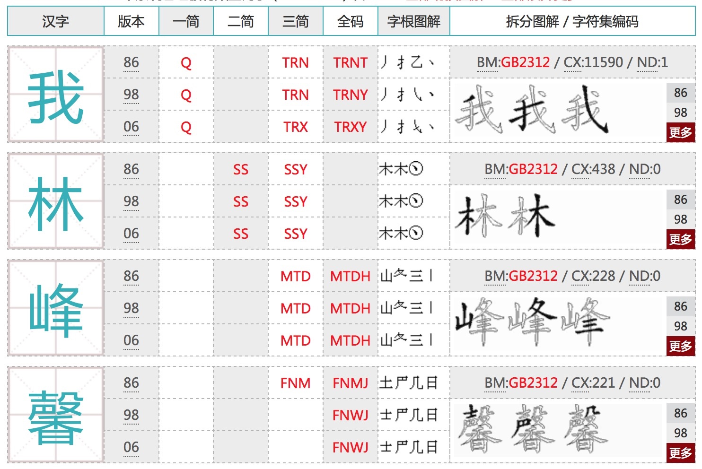
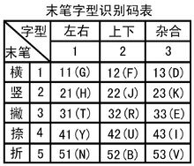

>
五笔真的不难  
语法1小时看懂    
练习1~3天就可以盲打  
然后就是长期的学习和提高。  

想简单写一下个五笔教程;   
网上看了一下……(无语了);    
明白为什么五笔太难,不好学了。    
  
因为教程太…繁杂…没重点啊。  
**学习很大的阻碍原来是…教程!**

## 一、背景知识 (可以不看)

五笔用25个字母编码。   
"Z"键作为特别键。( 在Rime输入软件中,用来临时输入拼音)  
每个字用4码。  

	25*25*25*25 = 390625 (39万字)

**理论上可以输出39万个字。**
>常用汉字只要 5,6千  
比较大的字库 2,3万字  
据说, 汉字大约有10万  

除了用来编单字;  
也可以编词组;  
一部词典的词组大约 2,3万。  

## 二、准备工作

* 使用五笔拼音混合输入 ("百度输入法",或"搜狗输入法"都有这个功能) 
* 打印一张字根图贴在桌前 (减少学习障碍)
* 详细的拆字方法查询: [http://www.chaiwubi.com/bmcx/?wz=查](http://www.chaiwubi.com/bmcx/?wz=查)
* 把查询加到 Alfred ,方便查询。(这不必须)

## 三、开始尝试

1. 除了`z`键。另外的25个字母都可以打出一个字。  
这25个字叫做 一级简码 (很高科技的名字,不要被吓到)    
例如: Q + 空格  ->  我  

2. 一级简码由 1个字母打出, 二级简码由2个字母打出。  
例如: SS + 空格 -> 林  

3. 三级简码由 3个字母+空格打出。  
例如: MTD + 空格 -> 峰  

4. 没有四级简码。五笔最多用4个键打出1个字。  
如果输入3个键还没有出现需要的汉字,最后一个键留给最后一笔。  
例如: FNMJ -> 馨  

**(以上4个规则就可以打出几十万个汉字)**

看看这个拆字查询网站体会一下:

[http://www.chaiwubi.com/bmcx/?wz=我林峰馨](http://www.chaiwubi.com/bmcx/?wz=我林峰馨)

<!--

-->

## 四、最小规则

1. 用字根,照笔划顺序。打出。
2. 如果字出现了,就按空格确定。
3. 如果超过4个码,顺序打出3个码后,最后一码用汉字的最后一码。
4. 如果打完编码,不够4码。补一位识别码。(极少出现)

## 五、什么是识别码? (建议跳过看 词组)

识别码是为了区分重码而设计的。  
也就是说**根本不需要使用。**  

为了教材完整,说一下。  

例子:  
KWU ->  只   
KWY -> 叭  

`只` 和 `叭`  
都是`口``八`(KW) 组成。  
最后一笔(末笔) 都为捺。  
`只`是上下结构, 查表可知, 识别码为 `U`  
`叭`是左右结构, 查表可知, 识别码为 `Y`  
[http://www.chaiwubi.com/bmcx/?wz=只叭](http://www.chaiwubi.com/bmcx/?wz=只叭)

<!--

-->

## 六、词组:
1. 2字词组,每个字取2码。(建议使用)  
2. 3字词组,前2个字,每个字取1码。最后一个字取2码。(可考虑使用)  
3. 4字词组,每个字取1码。(不建议使用)  
4. 超过4字,取前3个各一码,最后一码取最后一个字1码。(不建议使用)  

ChangeLog:  
2018-06-18 01:30 linfeng365 开始写  
2018-06-18 02:06 写到 三 先试试  
2018-06-18 02:49 写完,待整理。  
2018-06-18 02:55 完成。可发布  
2018-06-18 03:19 修整,更新。  